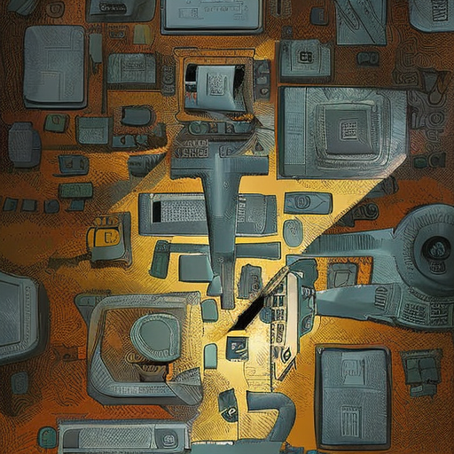
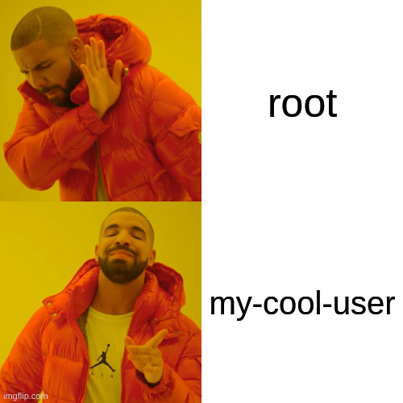
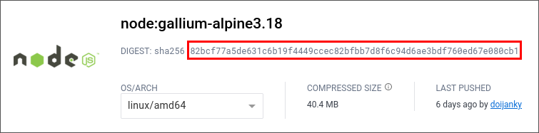

+++
title = "docker & microVMs - Exploring Security Boundaries and Assumptions"
outputs = ["Reveal"]
+++

## docker 🐋 & microVMs 🔍

#### Exploring Security Boundaries and Assumptions 👀

---

$ whoami


- Participate in organising NCSG
- nib Cybersecurity team
- homelab enthusiast
- terrible public speaker - but we'll push through!

---

## what is this talk about?

- docker 🐋
- how we might cause (in)security with docker 🔓
- what alternatives or protections might we utilise?

---

## what is this talk not about?

Slamming docker - it's still seriously cool tech 👍


---

## some caveats

Content in this talk is not my current professional life, nor a past one.

I do this as a hobbyist and don't know it all 😃

Please interrupt if you have questions 🙋

---

## definitions

Docker: we're talking here about plain ol' docker - not
in the scope of frameworks to extend it / manage it


---

## definitions

Virtual Machine: a host, hosted by a hypervisor



---

## definitions

MicroVM: uh?


---

## show of hands ✋

---

## who

Currently / has utilised:

- {}docker?{}
- {}virtual machines?{}
- {}microVMs?{}

---

We're going to exclude virtual machines and focus just on docker & microvms

---

Let's talk about what docker is and what a microVM is for a moment

---

Docker utilises kernel namespaces to isolate a workload from the host

It also utilises a chroot environment to expose the image filesystem

The same kernel as the host is effectively utilised

---

MicroVMs are extremely minimal virtual machines

The removal of extra installed packages, drivers and functionality of a system to make
attack surface minimal is essential

This reduces a vector called [LoLBAS](https://github.com/LOLBAS-Project/LOLBAS) compared to
traditional virtualisation

---

Let's get into some more common misconfigurations applied in docker and how they might be
addressed

---

## Lack of Runtime limits

Docker options include resource limits

Use them or an adversary might help you get the most out of your system resources 🚀

---

Either docker run or compose definitions are where you can apply controls for this

```yaml
deploy:
  resources:
    limits:
      cpus: "1.0"
      memory: "512M"
```

or

```bash
docker run ... --memory="512M" --cpus="1.0" ...
```

---

We're forced to address this issue in MicroVMs ahead of time in order to provision them
generally

```nix
{
  microvm = {
    hypervisor = "firecracker";
    vcpu = 1;
    mem = 512;
  };
}
```

---

## Excessive Image Inclusions

It's not uncommon to have too much in an image

---

Note: a lot, or all of these are not exploitable over a network and/or do not
have fixes from the package vendor 📦

Your threat modelling might however want to take this into account 🥷

But existing issues might give an adversary more capability in their attacks 🛠️

---

Let's consider node:latest as of 26th June, then we'll scan it with [trivy](https://github.com/aquasecurity/trivy)

```sh
trivy image --scanners vuln node:latest \
--format=json | trdsql -ijson -ojson 'SELECT * FROM -::".Results.[]"' \
| jq -r '.[].Vulnerabilities | select(.!=null)' \
| jq -s 'reduce (.[] | to_entries | .[]) as {$key, $value} ({}; .[$value.VulnerabilityID] += $value)' \
| trdsql -ijson -oat 'SELECT count(*), Severity FROM -::".[]" GROUP BY Severity'
```

---

## node:latest

| count(\*) | Severity |
| --------- | -------- |
| 3         | CRITICAL |
| 20        | HIGH     |
| 41        | MEDIUM   |
| 171       | LOW      |

---

Should a node image really have ssh?

```
node@68a085c380db:/$ which ssh
/usr/bin/ssh
```

---

mariadb_config?

git?

curl?

wget?

tar?

```bash
compgen -c | wc -l
1676
```

---

## node:slim

| count(\*) | Severity |
| --------- | -------- |
| 1         | HIGH     |
| 1         | MEDIUM   |
| 26        | LOW      |

---

## node:alpine

| count(\*) | Severity |
| --------- | -------- |
| 1         | MEDIUM   |

Note: this is a REDoS flaw - pretty benign for us in this context

---

## Defences for this issue

Some easy wins for defending in this space

- policy, process and culture advocating for minimalistic images - so easy if it's just you!
- read-only flag for both runtime command and volume mounts where possible
- consider running SCA on deployments prior to operationalisation - plenty of FOSS options

---

## tldr: Image Inclusions

If you don't need the fuller feature-set of some images, consider
opting for minimised images

---

## Could microVMs help?

MicroVMs may help here; Let's explore both trivy and vulnix to poke at a config-as-code
microVM!

---

The node microVM in [this repository](https://github.com/JayRovacsek/ncsg-presentation-june-2023) can
be built with:

```sh
nix build .\#nixosConfigurations.node-qemu-microvm-x86_64-linux.config.system.build.toplevel
```

Or we can be fancy and utilise an alternative hypervisor:

```sh
nix build .\#nixosConfigurations.node-cloud-hypervisor-microvm-x86_64-linux.config.system.build.toplevel
nix build .\#nixosConfigurations.node-crossvm-microvm-x86_64-linux.config.system.build.toplevel
nix build .\#nixosConfigurations.node-firecracker-microvm-x86_64-linux.config.system.build.toplevel
nix build .\#nixosConfigurations.node-kvmtool-microvm-x86_64-linux.config.system.build.toplevel
```

Note I've also included aarch64 targets - simply subsitute in place of x86_64-linux

---

Alternatively, if you want to use the image in your own hypervisor:

```
nix build .\#node-microvm-amazon
```

Or replace amazon with any of:

azure, do, docker, gce, hyperv, install-iso, install-iso-hyperv, iso, kubevirt, linode, lxc, lxc-metadata, openstack, proxmox, proxmox-lxc, qcow, raw, raw-efi, sd-aarch64, sd-aarch64-installer, vagrant-virtualbox, virtualbox, vm, vm-bootloader, vm-nogui, vmware

---

When you're defining a workload as code - building for alternate image types


---

From here, we can build each and use trivy's filesystem option:

```sh
trivy fs --scanners vuln --format=json ./result
```

Not super surprising but trivy likely doesn't follow symlinks or doesn't appreciate
the underlying filesystem we've created

```json
{
  "SchemaVersion": 2,
  "ArtifactName": "node-microvm",
  "ArtifactType": "filesystem",
  "Metadata": {
    "ImageConfig": {
      "architecture": "",
      "created": "0001-01-01T00:00:00Z",
      "os": "",
      "rootfs": {
        "type": "",
        "diff_ids": null
      },
      "config": {}
    }
  }
}
```

---

We'll instead lean on some a more native tooling: [vulnix](https://github.com/nix-community/vulnix)

```
vulnix --json /nix/store/nkvmpc96ysnjbvbv4f8vis1yrcg8kix3-nixos-system-node-microvm-23.11.20230622.3fb3ce0.drv | trdsql -ijson -ojson 'SELECT * FROM -::".[]"' \
| jq -r '[.[].cvssv3_basescore | to_entries | .[].value]' \
| trdsql -ijson -oat 'SELECT count(*), CASE WHEN c1 < 4 then "LOW" WHEN c1 > 3.9 AND c1 < 7 then "MEDIUM" WHEN c1 > 6.9 AND c1 < 8.9 then "HIGH" ELSE "CRITICAL" END as severity FROM -::".[]" GROUP BY severity ORDER by severity DESC'
```

| count(\*) | Severity |
| --------- | -------- |
| 2         | CRITICAL |
| 12        | HIGH     |
| 20        | MEDIUM   |
| 2         | LOW      |

```bash
compgen -c | wc -l
918
```

---


---

Turns out we're including build-time vulnerabilities in the above

```
cat vulnerabilities/microvm-reviewed.json \
| trdsql -ijson -ojson 'SELECT * FROM -::".[]"' \
| jq -r '[.[].cvssv3_basescore | to_entries | .[].value]' \
| trdsql -ijson -oat 'SELECT count(*), CASE WHEN c1 < 4 then "LOW" WHEN c1 > 3.9 AND c1 < 7 then "MEDIUM" WHEN c1 > 6.9 AND c1 < 8.9 then "HIGH" ELSE "CRITICAL" END as severity FROM -::".[]" GROUP BY severity ORDER by severity DESC'
```

| count(\*) | Severity |
| --------- | -------- |
| 2         | MEDIUM   |

Note: both of these are local access DoS vectors

---

We're equal to the slimmest option for the official node docker image - but including a full
kernel seperate to that of the hosts and the minimal set of requirements for running node.

---

## Verdict: Excessive Image Inclusions

Mileage may vary on this front: ultimately we want to reduce available resources to
an adversary - some docker images do this really well, others not so much.

---

## Excessive Permissions

If you've used docker, you likely saw this one coming

---

Running as root is really not needed for most workloads - consider the
daemon user as well as the container user

✂️🏃

---

## Instance User

Container instances can be ran as a suitable user within the namespace -
perfect to add further barriers to an adversarial breakout scenario ([documentation](https://docs.docker.com/develop/develop-images/dockerfile_best-practices/#user))

```yaml
RUN useradd -ms /bin/sh my-cool-user
USER my-cool-user
```

---



---

## Docker Runtime Mode

Docker can be ran in rootless mode for the daemon - options such as Portainer
will run this way by default and should be considered for use over docker if
suitable ([documentation](https://docs.docker.com/engine/security/rootless/))

---

Do microVMs help us in runtime and instance permissions?

---

Yes - but the same as docker, it simply requires a little effort to get there

Generally our instance is self defined - so footguns may exist here, but the
runtime itself is less likely to be dangerous given use of explicit drivers

---

Again, just don't run as root


---

## Docker Socket Mount

Somewhat commonly some docker images suggest the mount of the docker socket

```sh
docker run ... -v /var/run/docker.sock:/var/run/docker.sock ...
```


Mounting the docker socket isn't something you should always avoid, but it
is rather dangerous

---

## Verdict: Excessive Permissions

Again, mileage varies - popular docker images generally resolve this

MicroVMs being more explicit in only-need-to-have configuration might be
better here

---

## Security Configuration & Linux Capabilities

Using both [security configuration](https://docs.docker.com/engine/reference/run/#security-configuration)
options as well as _adding_ [Linux capabilities](https://docs.docker.com/engine/reference/run/#additional-groups)
should be avoided if possible

---

Security configuration option dangers

```sh
--security-opt="seccomp=unconfined"
```

_turns off seccomp confinement for the container_

(Filter applied to kernel capabilities)

---

Adding specifically rather spicy capabilities 🌶️:

- NET_ADMIN
- SYS_ADMIN

---

NET_ADMIN will depend on network configuration applied

---

SYS_ADMIN exposes kernel capabilities that are not always enforced via namespace

---

MicroVMs address this by not utilising the same kernel

---

## Verdict: Security Configuration & Linux Capabilities

A win for microVMs here - at the cost of-course of extra runtime resources.

But this is a security meetup 😅

---

## Building Images

Building Docker can be hard, utilising a base image we should consider reviewing it
for this one neat little trick

---

my-cool-repo/dockerfile

```yaml
ADD X
```

---

Anyone know the difference between `ADD` and `COPY`?

---

ADD allows the source to be a _*URL*_

I hope we're doing validation of the artefact 😈

---

## Verdict: Building Images

Generally less foot-gun in definition of microVMs - but use
of ADD is the single issue for Docker here

---

## Stability of Images

- docker run ... node:latest ...
- ???
- production outage
- ???
- profit?

---

When utilising Docker consider using immutable tags and explicit versions

```sh
docker pull node:gallium-alpine3.18
```

vs

```sh
docker pull node@sha256:82bcf77a5de631c6b19f4449ccec82bfbb7d8f6c94d6ae3bdf760ed67e080cb1
```



---

Otherwise package.lock v3 will get you


---

Issue here might be applying updates for an image over time - threat model this space 👍

---

MicroVMs address this space by being immutable by default

Shares can be mutable but the base image should not be

---

## Verdict: Stability of Images

So this is again, a case of you get what you give.

Docker can be trivially pinned, but generally isn't

MicroVMs are by default, but cause friction in the update process

---

## Recap

- Apply runtime limits
- Adopt a minimalist approach for asset deployment
- Applied minimal permissions for both the service and runtime user
- Don't add capabilities to instances without understanding what they do
- Don't utilise ADD either directly or transitively if you can
- Pin images if suitable

---

## Recap

MicroVM or Docker - it doesn't matter if you utilise good practices.

---

MicroVMs though - _so hot right now_


---

Questions?

---

Thank you! 🥰

---
